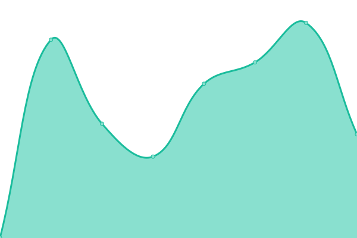
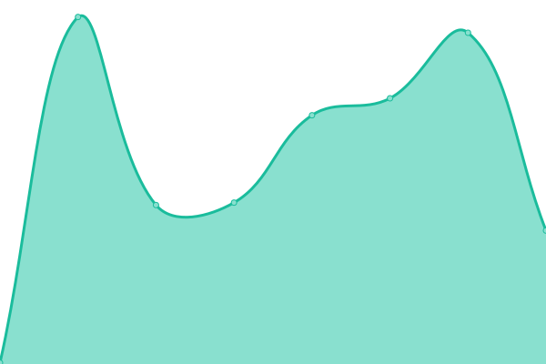

# [📈 Live Status](https://Cowrywise.github.io/uptime): <!--live status--> **🟩 All systems operational**

This repository contains the open-source uptime monitor and status page for [Cowrywise HQ](https://www.cowrywise.com), powered by [Upptime](https://github.com/upptime/upptime).

With [Upptime](https://upptime.js.org), you can get your own unlimited and free uptime monitor and status page, powered entirely by a GitHub repository. We use [Issues](https://github.com/Cowrywise/uptime/issues) as incident reports, [Actions](https://github.com/Cowrywise/uptime/actions) as uptime monitors, and [Pages](https://Cowrywise.github.io/uptime) for the status page.

<!--start: status pages-->
<!-- This summary is generated by Upptime (https://github.com/upptime/upptime) -->
<!-- Do not edit this manually, your changes will be overwritten -->
<!-- prettier-ignore -->
| URL | Status | History | Response Time | Uptime |
| --- | ------ | ------- | ------------- | ------ |
|  [Cowrywise Website](https://www.cowrywise.com) | 🟩 Up | [cowrywise-website.yml](https://github.com/cowrywise/uptime/commits/HEAD/history/cowrywise-website.yml) | 

 496ms
     
 | 

<a href="https://Cowrywise.github.io/uptime/history/cowrywise-website">100.00%</a>
    

|  [Cowrywise Dashboard](https://my.cowrywise.com) | 🟩 Up | [cowrywise-dashboard.yml](https://github.com/cowrywise/uptime/commits/HEAD/history/cowrywise-dashboard.yml) | 

 218ms
     
 | 

<a href="https://Cowrywise.github.io/uptime/history/cowrywise-dashboard">100.00%</a>
    

|  [Cowrywise Badges Page](https://cowrywise.com/@othreecodes/badges/savings-score) | 🟩 Up | [cowrywise-badges-page.yml](https://github.com/cowrywise/uptime/commits/HEAD/history/cowrywise-badges-page.yml) | 

 2464ms
     
 | 

<a href="https://Cowrywise.github.io/uptime/history/cowrywise-badges-page">100.00%</a>
    

|  [Cowrywise Circles](https://cowrywise.com/circles/challenges) | 🟩 Up | [cowrywise-circles.yml](https://github.com/cowrywise/uptime/commits/HEAD/history/cowrywise-circles.yml) | 

 952ms
     
 | 

<a href="https://Cowrywise.github.io/uptime/history/cowrywise-circles">100.00%</a>
    

|  [Cowrywise Round Up](https://2021.cowrywise.com) | 🟩 Up | [cowrywise-round-up.yml](https://github.com/cowrywise/uptime/commits/HEAD/history/cowrywise-round-up.yml) | 

 312ms
     
 | 

<a href="https://Cowrywise.github.io/uptime/history/cowrywise-round-up">100.00%</a>
    

|  [Cowrywise Blog](https://www.cowrywise.com/blog/) | 🟩 Up | [cowrywise-blog.yml](https://github.com/cowrywise/uptime/commits/HEAD/history/cowrywise-blog.yml) | 

 1046ms
     
 | 

<a href="https://Cowrywise.github.io/uptime/history/cowrywise-blog">100.00%</a>
    

<!--end: status pages-->

[**Visit our status website →**](https://Cowrywise.github.io/uptime)

## 📄 License

- Powered by: [Upptime](https://github.com/upptime/upptime)
- Code: [MIT](./LICENSE) © [Cowrywise HQ](https://www.cowrywise.com)
- Data in the `./history` directory: [Open Database License](https://opendatacommons.org/licenses/odbl/1-0/)
